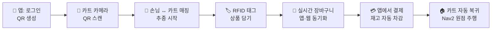
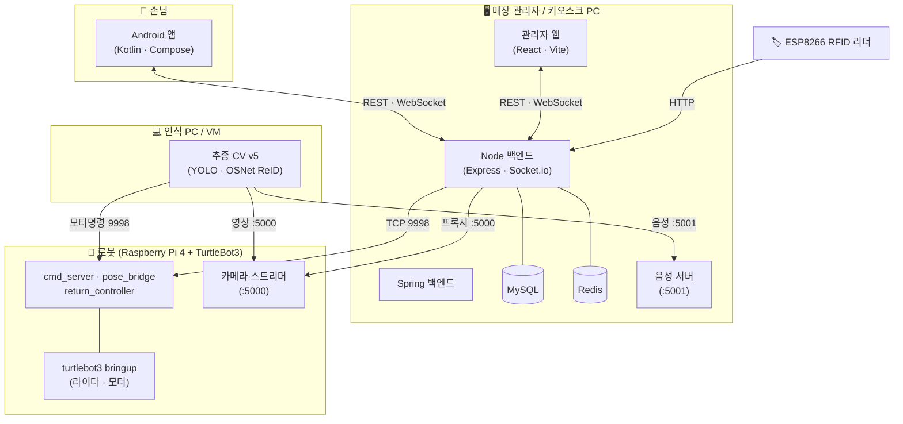

# 🛒 CartMe — 자율 추종 스마트 쇼핑카트

> QR 인증으로 손님과 짝을 맺고, 손님을 **따라다니며**, RFID로 담은 상품을 **자동 계산**하고, 결제가 끝나면 스스로 **복귀**하는 매장용 자율주행 카트 시스템.
>
> **`integration-clean`** — 앱 · 웹 · 백엔드 · 로봇(ROS2) · 인식(CV) · 하드웨어를 하나로 통합한 브랜치입니다. 추종 인식 코드는 **v5**로 통일되어 있습니다.

---

## 🎬 한눈에 보는 동작 흐름



1. **인증** — 손님이 앱에서 QR을 띄우고, 카트(로봇/키오스크) 카메라가 스캔 → 백엔드가 손님과 카트를 매칭
2. **추종** — CV(v5)가 등록된 손님만 인식해 카트가 따라다님 (촬영 등록 → ReID/색상/포즈 추종)
3. **담기** — 상품 RFID 태그를 리더에 대면 장바구니에 자동 추가 (앱·웹 실시간 반영)
4. **결제** — 앱에서 결제 → 주문 저장 + **재고 차감** + 로봇 복귀 신호
5. **복귀** — 카트가 Nav2로 시작 위치까지 자율 복귀

---

## 🧩 시스템 구성



| 구성요소 | 경로 | 스택 | 역할 |
|---|---|---|---|
| **손님 앱** | [`app/`](app/) | Kotlin · Jetpack Compose · Retrofit · Socket.io | 로그인 · QR 생성 · 실시간 장바구니 · 결제 · 카트 제어 |
| **관리자 웹** | [`web/`](web/) | React 19 · Vite · Socket.io | 대시보드 · 카메라 모니터링 · 재고/회원/문의 관리 · 로봇 제어 |
| **Node 백엔드** | [`node-backend/`](node-backend/) | Express · MySQL · Redis · Socket.io · JWT | 메인 API · 실시간 이벤트 · 하드웨어 연동 허브 |
| **Spring 백엔드** | [`backend/`](backend/) | Spring Boot · Gradle | 보조 백엔드 |
| **로봇 주행** | [`ros_ws/`](ros_ws/) | ROS2 Humble · Nav2 · TurtleBot3 | 브릿지 노드 · 위치/배터리 전송 · SLAM 복귀 |
| **추종 인식 (v5)** | [`OpenCV_2/v2/`](OpenCV_2/v2/) | Python · OpenCV · YOLOv8 · OSNet ReID | 등록 손님 인식 · 추종 속도 제어 |
| **RFID 리더** | [`Arduino/`](Arduino/) | ESP8266 · MFRC522 | 상품 태그 스캔 → 백엔드 전송 |
| **QR 스캐너** | [`qr/`](qr/) | Python · OpenCV | (카트 카메라 대체용) QR 인식 시뮬레이터 |

---

## 🚀 빠른 시작 (Quick Start)

### 사전 준비
- **Node.js 18+**, **Python 3.11**, **Java 17+**, **Docker** (Redis용), **MySQL 8**
- MySQL에 스키마 적용: [`node-backend/db/schema.sql`](node-backend/db/schema.sql)
- `node-backend/.env` 설정 (아래 [환경 변수](#-환경-변수) 참고)

### 한 번에 켜기 / 끄기 (Windows PowerShell)
```powershell
cd d:\YH
.\start-all.ps1     # MySQL → Redis → Node → Spring → 웹 순서로 각각 새 창에 기동
.\stop-all.ps1      # 전부 종료 (-All 붙이면 MySQL·Redis 까지)
```

### 수동 기동
```powershell
# 1. 인프라
Start-Service MySQL801
docker start cartpilot-redis

# 2. Node 백엔드 (:3000) — 시작 시 ipUpdater 가 모든 클라이언트 IP 자동 동기화
cd node-backend; npm start

# 3. Spring 백엔드 (:8080)
cd backend; .\gradlew.bat bootRun

# 4. 관리자 웹 (:5173)
cd web; npm run dev

# 5. (선택) 키오스크 음성 서버 (:5001) — 로봇 안내 음성 재생
python node-backend\scripts\kiosk_speak_server.py 5001
```

접속: **관리자 웹 http://localhost:5173** · **API http://localhost:3000**

### 로봇 (Raspberry Pi)
```bash
# 브릿지 3종 (명령 수신 · 위치 전송 · 복귀 제어)
cd ~/mainproject/ros_ws && bash bridge/run_bridge.sh start
# 카메라 스트리머 (:5000)
python3 pi_camera_streamer.py
# 주행이 필요하면 bringup (라이다 · 모터)
ros2 launch turtlebot3_bringup robot.launch.py usb_port:=/dev/ttyACM0
```

### 추종 인식 (VM / 인식 PC)
```bash
cd OpenCV_2/v2
python3 ros_person_follower_nav2_v5.py \
  --pi-ip <라파IP> --esp-ip <ESP IP> \
  --speak-ip <키오스크IP>:5001 --register
```

---

## 🌐 IP 자동 동기화 (중요)

여러 기기가 같은 Wi-Fi에서 도는 구조라 **PC IP가 바뀌면** 앱·웹·아두이노·QR·로봇이 백엔드를 못 찾습니다. 이를 위해 **ipUpdater**가 있습니다:

- `node-backend/.env`의 **`BACKEND_IP`** 한 값만 현재 PC IP로 고치고 Node를 재시작하면,
- 웹 소스(9개) · 안드로이드 `RetrofitClient.kt` · 아두이노 `.ino` · `pi_camera_streamer`용 주소 · QR 스캐너까지 **자동으로 일괄 갱신**됩니다. ([`node-backend/src/utils/ipUpdater.js`](node-backend/src/utils/ipUpdater.js))
- 로봇 IP가 바뀌면 `.env`의 **`PI_HOST`** 만 고치고 Node 재시작.

> 💡 시연 안정성을 위해 공유기에서 PC·로봇·ESP를 **DHCP 예약(고정 IP)** 하는 것을 권장합니다.

---

## 🔌 포트 정리

| 포트 | 위치 | 용도 |
|---|---|---|
| 3000 | 키오스크 PC | Node 백엔드 (REST · WebSocket) |
| 8080 | 키오스크 PC | Spring 백엔드 |
| 5173 | 키오스크 PC | 관리자 웹 (Vite dev) |
| 5001 | 키오스크 PC | 음성 서버 (로봇 안내 재생) |
| 3306 · 6379 | 키오스크 PC | MySQL · Redis |
| 5000 | 로봇 | 카메라 MJPEG 스트림 (+ `/speak` TTS) |
| 9998 | 로봇 | cmd_server (정지/재개/복귀 TCP 명령) |

---

## 🔑 환경 변수 (`node-backend/.env`)

```ini
PORT=3000
JWT_SECRET=<시크릿>
BACKEND_IP=192.168.0.x     # 이 PC의 LAN IP — ipUpdater 가 클라이언트에 동기화
DB_HOST=localhost
DB_PORT=3306
DB_NAME=cartpilot_db
REDIS_PORT=6379
PI_HOST=192.168.0.x        # 로봇(라즈베리파이) IP
PI_CMD_PORT=9998
```

---

## 📡 주요 API (Node 백엔드)

| 메서드 · 경로 | 설명 |
|---|---|
| `POST /api/auth/register` · `login` | 회원가입 · 로그인 (JWT) |
| `GET /api/auth/qr` | 손님 QR 토큰 발급 (Redis TTL) |
| `POST /api/hardware/qr-scan` | 카트 QR 스캔 → 손님·카트 매칭 |
| `POST /api/hardware/rfid` | RFID 상품 스캔 → 장바구니 추가 |
| `GET /api/hardware/video-feed` | 로봇/노트북 카메라 스트림 프록시 |
| `POST /api/hardware/pose` · `telemetry` | 로봇 위치 · 배터리 수신 |
| `POST /api/hardware/announce` | 로봇 안내 음성 → 웹 브라우저 TTS 중계 |
| `POST /api/orders/complete` | 결제 완료 → 주문 저장 · **재고 차감** · 복귀 |
| `POST /api/robot/stop` · `resume` | 앱에서 로봇 정지 · 추종 재개 |
| `POST /api/admin/robot/reset-session` | 관리자 세션 강제 초기화 |
| `GET /api/admin/dashboard` | 대시보드 실데이터 |

데이터: **MySQL** (`users` · `products` · `robots` · `orders` · `order_items` · `inquiries`) + **Redis** (QR 토큰 · 장바구니 · 로봇 상태 캐시)

---

## 📁 디렉터리 구조

```
├── app/                  손님용 Android 앱 (Kotlin · Compose)
├── web/                  관리자 웹 (React · Vite)
├── node-backend/         메인 백엔드 (Express · MySQL · Redis · Socket.io)
│   ├── src/routes·controllers   API
│   ├── src/utils/ipUpdater.js    IP 자동 동기화
│   ├── scripts/kiosk_speak_server.py  음성 서버
│   └── db/schema.sql              DB 스키마
├── backend/              Spring 백엔드
├── ros_ws/               ROS2 워크스페이스 (브릿지 · 주행 · SLAM 맵)
├── OpenCV_2/v2/          추종 인식 v5 (+ light_features · light_models · models_light)
├── Arduino/              ESP8266 RFID 리더 펌웨어
├── qr/                   QR 스캐너 시뮬레이터
├── ros_ws/turtlebot3-setup.md     로봇 bringup · SLAM 셋업 기록
├── start-all.ps1 · stop-all.ps1   전체 기동/종료 스크립트
```

---

## 🗺️ 브랜치

| 브랜치 | 내용 |
|---|---|
| **`integration-clean`** | **통합본** — 전 구성요소 + 추종 v5 (← 현재 문서) |
| `HJ` · `ks` · `kw` · `sh` | 담당자별 개발 브랜치 |
| `main` | 초기 베이스 |
